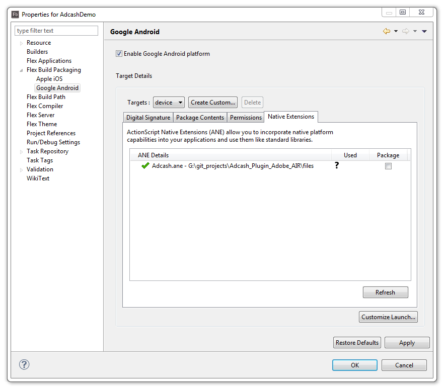
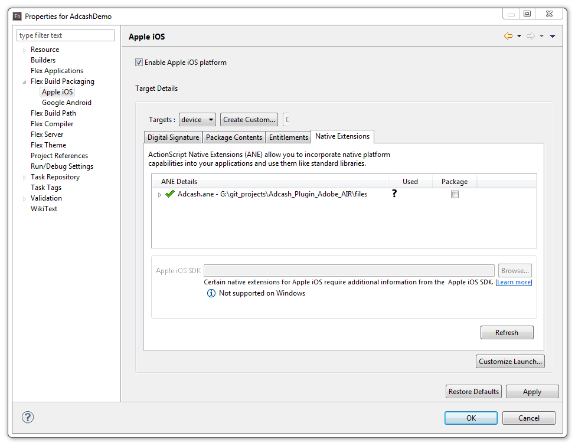

## Adcash&reg; Native Extension for Adobe AIR
---
### Introduction
The **Adcash&reg; native extension** provides the following features:
* Support for Banner Ads
* Support for Interstitial Ads
* Banner positions(top/bottom)
* Events that you can listen for
* A sample project to demonstrate the native extension integration

Applications that integrate the native extension can run on:
* **Android** (both actual devices and emulators; ARM and x86 CPU's are both supported)
* **iOS** (both actual devices and simulators)

And the requirements are:
* Adobe AIR SDK **18.0**
* Apache Flex SDK **4.14.1**
* **Zone ID(s)**. You create these at [Adcash website](https://www.adcash.com/console/scripts.php).
* To package your app for **Android**:
    * Android SDK 22 or newer
* To package your app for **iOS**:
    * Xcode 6.4 or newer

> Note: To integrate **Adcash&reg; native extension** into your project you follow the same procedure as for other native extensions. We have included instructions for **Adobe Flash Builder 4.7** IDE below. However other IDEs should work just as well.

### Integrate the Native Extension
Download the `Adcash.ane` file [here](https://github.com/adcash/adcash-air-native-extension) and add it to your application as a **native extension** by following these steps:
1. Right-click on your project and select **Properties**. 
    
    Navigate to **Flex Build Path > Native Extensions**, select **Add ANE...** and browse to the `Adcash.ane` to add it:

    

2. If your app will run on Android, go to **Flex Build Packaging > Google Android > Native Extensions** and make sure the **Package** check box for the `Adcash.ane` is checked:

    

3. If your app will run on iOS, go to **Flex Build Packaging > Apple iOS > Native Extensions** and make sure the **Package** check box for the `Adcash.ane` is checked:

    

### Configure the Native Extension
Before you can use our native extension in your code, you need the following import declaration:

```javascript
import com.adcash.*;
```

Also, declare the **Adcash** object variable as well as variables for the **Zone ID(s)**:

```javascript
protected var _adcash:Adcash = new Adcash();
public var _interstitialZoneId:String;
public var _bannerZoneId:String;
```

Make sure to set the **Zone ID(s)** for the ad type(s) that you would use. You need different **Zone ID(s)** for Android and iOS.   
In case your application is to run both on Android and iOS devices, you can use the following logic:

```javascript
var version:String = Capabilities.version;

// By default take the iOS zone IDs:
_interstitialZoneId = "<YOUR_IOS_INTERSTITIAL_ZONE_ID_HERE>";
_bannerZoneId = "<YOUR_IOS_BANNER_ZONE_ID_HERE>";

// If the device is with Android OS, change them:
if(version.indexOf("AND") == 0){
	_interstitialZoneId = "<YOUR_ANDROID_INTERSTITIAL_ZONE_ID_HERE>";
	_bannerZoneId = "<YOUR_ANDROID_BANNER_ZONE_ID_HERE>";
}
```

#### Banner
To show a banner in your application do the following:

```javascript
_adcash.loadBanner(_bannerZoneId, AdPosition.POSITION_BOTTOM);
```

After the banner ad is loaded, it will show automatically.

The available **events** that you can listen for are:

```javascript
_adcash.addEventListener(AdEvent.BANNER_LOAD_OK, myEventHandler);
_adcash.addEventListener(AdEvent.BANNER_LOAD_FAIL, myEventHandler);
_adcash.addEventListener(AdEvent.BANNER_LEFT_APP, myEventHandler);
```

#### Interstitial
To show an interstitial add the following:

```javascript
_adcash.loadInterstitial(_interstitialZoneId);
```

After an interstitial ad is loaded, it will not show automatically.
At convenient points in the execution of your application you can check if an interstitial has been loaded and is ready to be displayed by calling the `isInterstitialReady()` method.   
When the interstitial is ready you call:

```javascript
_adcash.showInterstitial();
```

The available **events** that you can listen for are:

```javascript
_adcash.addEventListener(AdEvent.INTERSTITIAL_SHOW_OK, myEventHandler);
_adcash.addEventListener(AdEvent.INTERSTITIAL_SHOW_FAIL, myEventHandler);	
_adcash.addEventListener(AdEvent.INTERSTITIAL_LOAD_OK, myEventHandler);
_adcash.addEventListener(AdEvent.INTERSTITIAL_LOAD_FAIL, myEventHandler);
_adcash.addEventListener(AdEvent.INTERSTITIAL_OPENED, myEventHandler);
_adcash.addEventListener(AdEvent.INTERSTITIAL_CLOSED, myEventHandler);
_adcash.addEventListener(AdEvent.INTERSTITIAL_LEFT_APP, myEventHandler);
```

### Conversion Tracking
If you are an advertiser, you might want to send us some information when your app has been opened so that we can track a successful conversion:

```javascript
_adcash.reportAppOpen();
```

### Sample Project
You can find an example of how to integrate and use the native extension [here](https://github.com/adcash/adcash-air-native-extension).

If you use Adobe Flash Builder, you can open the sample project by selecting **File > Import Flash Builder Project...** from the menu and choosing the `Demo.fxp` file.

### Special Considerations
The **Adcash&reg; native extension** can conflict with other third-party native extensions. If a conflict occurs, it will be detected at the application packaging phase. 

If you stumble upon such a conflict, please notify us and we will work to resolve it.

### Support
If you need any support or assistance you can contact us by sending email to <mobile@adcash.com>.
